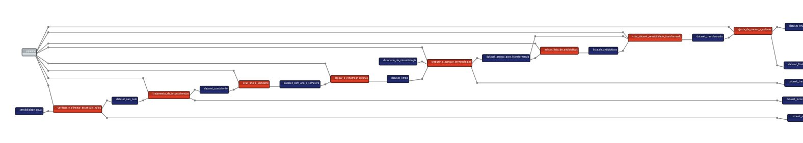

# HSM-ETL Project

Este projeto realiza a extração, transformação e carga (ETL) de dados para o ResisTracker a partir de planilhas Excel.

## Benefícios de um Pipeline Bem-Estruturado

Um pipeline bem-feito oferece diversos benefícios, tais como:



- **Consistência:** Garante que o processo de ETL seja executado de maneira consistente, evitando erros e mantendo a integridade dos dados.

- **Rastreabilidade:** Facilita o rastreamento de alterações e a compreensão do fluxo de dados.

- **Manutenibilidade:** Simplifica a manutenção e atualização do pipeline, tornando mais fácil incorporar novos requisitos ou ajustar transformações existentes.

## Pré-requisitos

Antes de começar, certifique-se de ter o Git e o Python com o pip instalados.

### Instalação do Git

Para instalar o Git, siga as instruções em [git-scm.com](https://git-scm.com/book/pt-br/v2/Come%C3%A7ando-Instalando-o-Git).

## Utilização:

Para fazer uso deste projeto, adicione o seu arquivo na pasta data/raw com o nome perfil_microbiologico.csv.
Atenção ! O arquivo deve possui este nome e a estrutura de colunas deve ser a mesma do arquivo modelo.

## Clonando o Repositório

Use o seguinte comando para clonar o repositório:

```bash
git clone https://github.com/Solude-evidence-informed-health/HSM-ETL
cd HSM-ETL
```

## Instalação dos Requisitos
Instale os requisitos do projeto utilizando o pip:

```bash
pip install -r requirements.txt
```

## Executando o Script
Execute o script de ETL com o seguinte comando:

```bash
python hsm_pipeline.py
```

Isso iniciará o processo de transformação dos dados para o modelo do resistracker, gerando arquivos de log e de saída.

